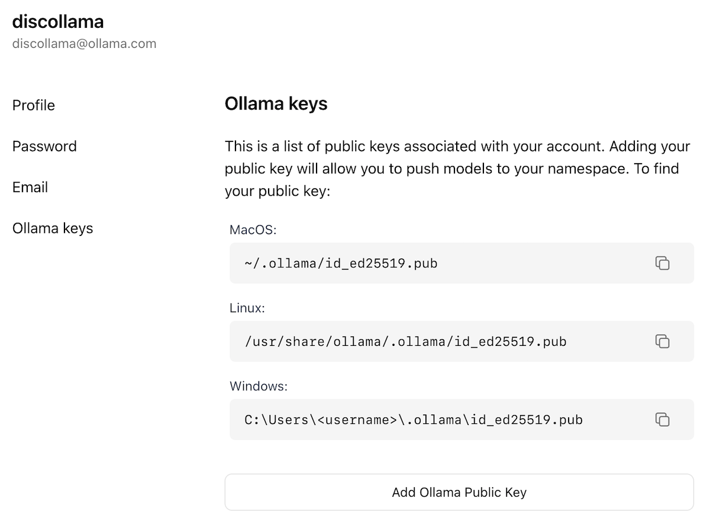

# モデルのインポート

## 目次

* [Safetensors アダプターのインポート](#Importing-a-fine-tuned-adapter-from-Safetensors-weights)
* [Safetensors モデルのインポート](#Importing-a-model-from-Safetensors-weights)
* [GGUF ファイルのインポート](#Importing-a-GGUF-based-model-or-adapter)
* [ollama.com でのモデルの共有](#Sharing-your-model-on-ollamacom)

## Importing a fine tuned adapter from Safetensors weights

まず、微調整に使用した基本モデルを指す `FROM` コマンドと、Safetensors アダプターがあるディレクトリを指す `ADAPTER` コマンドを使用して `Modelfile` を作成します。

```dockerfile
FROM <base model name>
ADAPTER /path/to/safetensors/adapter/directory
```

`FROM` コマンドでは、アダプタの作成に使用したのと同じベースモデルを使用してください。そうでないと、不安定な結果になります。多くのフレームワークは異なる量子化手法を使用しているため、量子化されていない（つまりQLoRAではない）アダプタを使用することをお勧めします。アダプタが `Modelfile` と同じディレクトリにある場合は、`ADAPTER .` を使用してアダプタのパスを指定してください。

次に、`Modelfile` が作成されたディレクトリから `ollama create` を実行します:

```shell
ollama create my-model
```

最後に、モデルをテストします:

```shell
ollama run my-model
```

Ollamaは、以下のモデルアーキテクチャに基づくアダプターのインポートをサポートしています。

* Llama（Llama 2、Llama 3、Llama 3.1、Llama 3.2を含む）
* Mistral（Mistral 1、Mistral 2、Mixtralを含む）
* Gemma（Gemma 1およびGemma 2を含む）

Safetensors形式でアダプターを出力できるファインチューニングフレームワークまたはツールを使用してアダプターを作成できます。以下に例を示します。

* Hugging Face [ファインチューニングフレームワーク](https://huggingface.co/docs/transformers/en/training)
* [Unsloth](https://github.com/unslothai/unsloth)
* [MLX](https://github.com/ml-explore/mlx)

## Importing a model from Safetensors weights

まず、Safetensors の重みを含むディレクトリを指す `FROM` コマンドを使用して `Modelfile` を作成します:

```dockerfile
FROM /path/to/safetensors/directory
```

重みと同じディレクトリにモデルファイルを作成する場合は、`FROM .` コマンドを使用できます。

`Modelfile` を作成したディレクトリから `ollama create` コマンドを実行します:

```shell
ollama create my-model
```

最後に、モデルをテストします:

```shell
ollama run my-model
```

Ollamaは、以下の様々なアーキテクチャのモデルのインポートをサポートしています。

* Llama（Llama 2、Llama 3、Llama 3.1、Llama 3.2を含む）
* Mistral（Mistral 1、Mistral 2、Mixtralを含む）
* Gemma（Gemma 1、Gemma 2を含む）
* Phi3

これには、基礎モデルだけでなく、基礎モデルと融合された微調整モデルのインポートも含まれます。

## Importing a GGUF based model or adapter

GGUFベースのモデルまたはアダプターをお持ちの場合は、Ollamaにインポートできます。GGUFモデルまたはアダプターは以下の方法で入手できます。

* Llama.cppの`convert_hf_to_gguf.py`を使用してSafetensorsモデルを変換する。
* Llama.cppの`convert_lora_to_gguf.py`を使用してSafetensorsアダプターを変換する。
* HuggingFaceなどのサイトからモデルまたはアダプターをダウンロードする。

GGUFモデルをインポートするには、以下の内容を含む`Modelfile`を作成します。

```dockerfile
FROM /path/to/file.gguf
```

GGUF アダプタの場合は、次のように `Modelfile` を作成します。

```dockerfile
FROM <model name>
ADAPTER /path/to/file.gguf
```

GGUFアダプタをインポートする際は、アダプタの作成に使用したベースモデルと同じベースモデルを使用することが重要です。以下のモデルを使用できます。

* Ollamaのモデル
* GGUFファイル
* Safetensorsベースのモデル

`Modelfile`を作成したら、`ollama create`コマンドを使用してモデルをビルドします。

```shell
ollama create my-model
```

## Quantizing a Model

モデルを量子化すると、モデルの実行速度が向上し、メモリ消費量も削減されますが、精度は低下します。これにより、より低性能のハードウェアでもモデルを実行できるようになります。

Ollamaは、`ollama create`コマンドに`-q/--quantize`フラグを指定することで、FP16およびFP32ベースのモデルを異なる量子化レベルに量子化できます。

まず、量子化したいFP16またはFP32ベースのモデルを含むモデルファイルを作成します。

```dockerfile
FROM /path/to/my/gemma/f16/model
```

次に、`ollama create` を使用して量子化モデルを作成します。

```shell
$ ollama create --quantize q4_K_M mymodel
transferring model data
quantizing F16 model to Q4_K_M
creating new layer sha256:735e246cc1abfd06e9cdcf95504d6789a6cd1ad7577108a70d9902fef503c1bd
creating new layer sha256:0853f0ad24e5865173bbf9ffcc7b0f5d56b66fd690ab1009867e45e7d2c4db0f
writing manifest
success
```

### Supported Quantizations

- `q8_0`

#### K-means Quantizations

- `q4_K_S`
- `q4_K_M`


## Sharing your model on ollama.com

作成したモデルは、[ollama.com](https://ollama.com) にプッシュすることで共有でき、他のユーザーに試用してもらうことができます。

まず、ブラウザを使って [Ollama サインアップ](https://ollama.com/signup) ページにアクセスしてください。既にアカウントをお持ちの場合は、この手順をスキップしてください。


「ユーザー名」フィールドはモデル名の一部として使用されます（例：jmorganca/mymodel）。選択したユーザー名に間違いがないかご確認ください。

アカウントを作成してサインインしたら、[Ollama Keys Settings](https://ollama.com/settings/keys) ページに移動します。

ページの指示に従って、Ollama 公開鍵の場所を確認してください。



「Ollama公開鍵を追加」ボタンをクリックし、Ollama公開鍵の内容をコピーしてテキストフィールドに貼り付けてください。

モデルを[ollama.com](https://ollama.com)にプッシュするには、まずモデル名がユーザー名に基づいて正しく設定されていることを確認してください。正しい名前を付けるには、`ollama cp`コマンドを使用してモデルをコピーする必要がある場合があります。モデル名が決まったら、`ollama push`コマンドを使用して[ollama.com](https://ollama.com)にプッシュしてください。

```shell
ollama cp mymodel myuser/mymodel
ollama push myuser/mymodel
```

モデルがプッシュされると、他のユーザーは次のコマンドを使用してモデルをプルして実行できます。

```shell
ollama run myuser/mymodel
```

